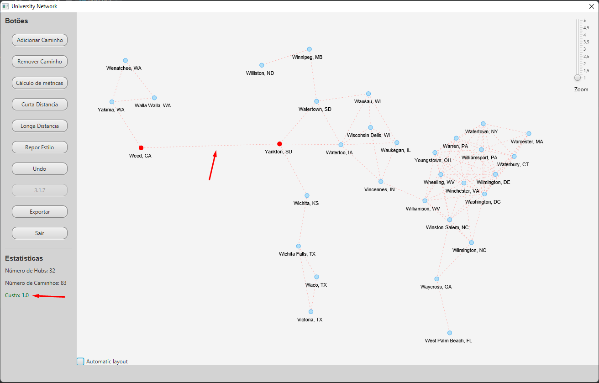

# Projeto PA 2021/22 - Época Normal (Projeto Funcional)

Este ficheiro contém um resumo do trabalho / código desenvolvido.

## Objetivos

 (1) - Melhorias da milestone
 (2) - Implementação dos Mockups
 (3) - Cálculo de métricas
 (4) - Adição e remoção de rotas e disponibilização de funcionalidade de Undo
 (5) - Exportar rotas (matriz de distâncias)
 (6) - Cálculo de caminhos mais curtos entre um par de hubs
 (7) - Par de hubs mais distante
 (8) - Hubs que distam N rotas do hub H

## Resumo do Trabalho

Nesta fase, começou-se pelas melhorias da fase anterior, corrigindo alguns bugs existentes e terminando certos métodos. 
Implementou-se um dos mockups criados, de maneira a deixar o programa mais fácil de navegar. Foi implementado o Dijkstra para calcular as rotas mais curtas entre hubs, e o caminho mais longo do gráfico; foi também criado um gráfico de barras que apresenta o top 5 de hubs com mais rotas incidentes.
Utilizamos o padrão Model View Controller (MVC), para atualizar a View sempre que houvesse alterações no gráfico.
Não foi implementado com sucesso a funcionalidade da exportação de rotas (matriz de distâncias).

### Demonstração do Projeto Funcional

Como pode ser visto na imagem de demonstração, foi adicionado uma rota entre os hubs "Weed, CA" e "Yankton, SD", e do lado esquerdo, aparece o custo de 1.

